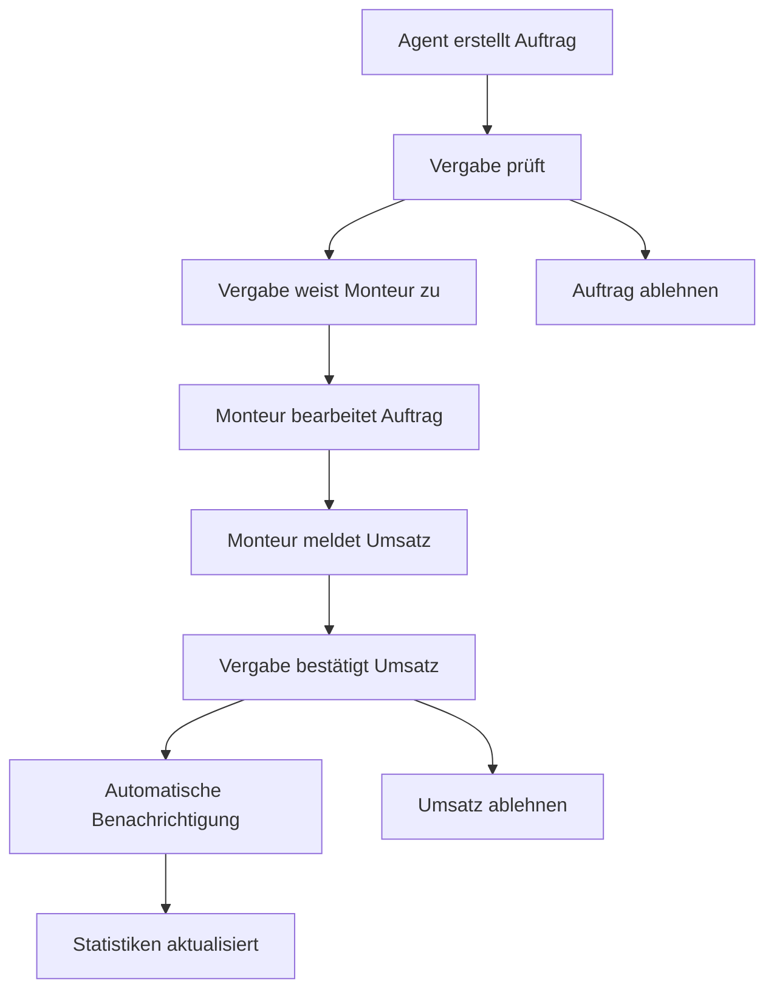

# 🎯 AMP 2.0 - Auftragsmanager Pro

> **Professionelle Telegram Mini App für Auftragsmanagement mit n8n Backend und Google Sheets Integration**

[](https://semver.org)
[](https://nodejs.org)
[](LICENSE)

## 🚀 Features

### 👥 Rollenbasiertes System
- **🔧 Monteure**: Umsätze melden, Aufträge bearbeiten, Fotos hochladen
- **🏢 Agenten**: Neue Aufträge erstellen, Kundendaten verwalten
- **✅ Vergabe**: Umsätze bestätigen, Aufträge zuweisen, Qualitätskontrolle
- **👨‍💼 Admin**: Vollzugriff, Berichte, Systemverwaltung

### 💰 Umsatz-Workflow
1. **Monteur meldet Umsatz** → Fotos + Beschreibung
2. **Vergabe prüft & bestätigt** → Qualitätskontrolle
3. **Automatische Benachrichtigungen** → Telegram Updates
4. **Statistiken & Berichte** → Google Sheets Integration

### 🎯 Auftragsverwaltung
- **Automatische Zuweisung** nach Postleitzahl
- **Prioritäten-System** (Dringend, Normal, Niedrig)
- **Echtzeit-Status** Updates
- **Foto-Upload** für Dokumentation

### 📊 Intelligente Statistiken
- **Dashboard-Übersicht** für alle Rollen
- **Umsatz-Tracking** in Echtzeit
- **Performance-Metriken** pro Monteur
- **Google Sheets Export** für Buchhaltung

## 🛠 Technologie-Stack

- **Frontend**: Vanilla JavaScript, CSS3, Telegram Web App API
- **Backend**: Node.js, Express.js
- **Workflow-Engine**: n8n (Low-Code Automation)
- **Datenbank**: Google Sheets (einfach zu verwalten)
- **Benachrichtigungen**: Telegram Bot API
- **Hosting**: Jeder Node.js-kompatible Server

## 📱 Screenshots

### Dashboard (Monteur)


### Umsatz melden


### Bestätigungen (Vergabe)


## 🚀 Schnellstart

### 1. Repository klonen
```bash
git clone https://github.com/ihr-username/amp-telegram-app.git
cd amp-telegram-app
npm install
```

### 2. Umgebung konfigurieren
```bash
cp .env.example .env
# Bearbeiten Sie .env mit Ihren Daten
```

### 3. Server starten
```bash
npm run dev  # Entwicklung
npm start    # Produktion
```

### 4. Telegram Bot konfigurieren
```bash
# Webhook setzen
curl -X POST "https://api.telegram.org/bot<BOT_TOKEN>/setWebhook" \
     -H "Content-Type: application/json" \
     -d '{"url": "https://ihre-domain.com/webhook/telegram"}'
```

📖 **[Vollständige Installationsanleitung](INSTALLATION.md)**

## 🎯 Workflow-Übersicht



## 🔧 Konfiguration

### Benutzer verwalten
```javascript
// config.js
userDatabase: {
    '+491234567890': {
        password: 'sicher123',
        role: 'monteur',
        name: 'Max Mustermann',
        initials: 'MM',
        permissions: ['report_revenues', 'view_assigned_orders']
    }
}
```

### Automatische Zuweisung
```javascript
workflowConfig: {
    autoAssignment: {
        enabled: true,
        rules: [
            { postcodes: ['10***', '11***'], monteurId: '+491234567890' },
            { postcodes: ['20***', '21***'], monteurId: '+4369912345678' }
        ]
    }
}
```

## 📊 API Endpunkte

### Webhook API
```javascript
POST /api/webhook
{
    "action": "create_order",
    "userContext": { ... },
    "data": { ... }
}
```

### Verfügbare Aktionen
- `create_order` - Neuen Auftrag erstellen
- `report_revenue` - Umsatz melden
- `approve_revenue` - Umsatz bestätigen
- `assign_order` - Auftrag zuweisen
- `get_dashboard_data` - Dashboard-Daten laden
- `get_pending_approvals` - Ausstehende Bestätigungen

## 🔒 Sicherheit

- ✅ **HTTPS-only** für Telegram Mini Apps
- ✅ **Rollenbasierte Berechtigungen**
- ✅ **Input-Validierung** auf allen Ebenen
- ✅ **Sichere Dateiuploads** mit Größen-/Typlimits
- ✅ **Umgebungsvariablen** für Geheimnisse

## 📈 Performance

- ⚡ **Lazy Loading** für große Datensätze
- ⚡ **Optimierte Bilder** (automatische Kompression)
- ⚡ **Caching** für häufige Anfragen
- ⚡ **Responsive Design** für alle Geräte

## 🧪 Testing

```bash
# Unit Tests
npm test

# Integration Tests
npm run test:integration

# E2E Tests (mit Playwright)
npm run test:e2e
```

## 📦 Deployment

### Mit PM2 (empfohlen)
```bash
npm install -g pm2
pm2 start ecosystem.config.js
pm2 save
pm2 startup
```

### Mit Docker
```bash
docker build -t amp-app .
docker run -p 3000:3000 --env-file .env amp-app
```

### Mit Heroku
```bash
git push heroku main
heroku config:set NODE_ENV=production
heroku config:set TELEGRAM_BOT_TOKEN=...
```

## 🤝 Contributing

1. Fork das Repository
2. Erstellen Sie einen Feature Branch (`git checkout -b feature/AmazingFeature`)
3. Commit Ihre Änderungen (`git commit -m 'Add some AmazingFeature'`)
4. Push zum Branch (`git push origin feature/AmazingFeature`)
5. Öffnen Sie eine Pull Request

## 📝 Changelog

### [2.0.0] - 2024-01-20
#### Added
- ✨ Vollständig überarbeitete UI mit Telegram-nativen Farben
- 🎯 Rollenbasiertes Berechtigungssystem
- 💰 Umsatz-Bestätigungsworkflow
- 📊 Erweiterte Dashboard-Statistiken
- 📷 Foto-Upload für Aufträge
- 🔄 Google Sheets Integration
- 📱 Telegram Bot mit Rich Commands
- ⚡ n8n Workflow-Automatisierung

#### Changed
- 🎨 Komplett neues Design-System
- 🚀 Verbesserte Performance
- 📱 Bessere Mobile-Experience

#### Fixed
- 🐛 Verschiedene UI-Bugs behoben
- 🔒 Sicherheitslücken geschlossen

## 📞 Support

- 📧 **E-Mail**: support@amp-app.com
- 💬 **Telegram**: [@AMPSupport](https://t.me/AMPSupport)
- 📖 **Dokumentation**: [Wiki](https://github.com/ihr-username/amp-telegram-app/wiki)
- 🐛 **Bug Reports**: [Issues](https://github.com/ihr-username/amp-telegram-app/issues)

## 📄 Lizenz

Dieses Projekt steht unter der MIT-Lizenz. Siehe [LICENSE](LICENSE) für Details.

## 🙏 Danksagungen

- [Telegram](https://telegram.org) für die großartige Bot API
- [n8n](https://n8n.io) für die flexible Workflow-Engine
- [Google Sheets API](https://developers.google.com/sheets) für die einfache Datenspeicherung
- Alle Contributors die dieses Projekt möglich gemacht haben

---

<div align="center">

**Gebaut mit ❤️ für professionelle Teams**

[Demo](https://amp-demo.herokuapp.com) • [Dokumentation](INSTALLATION.md) • [Support](mailto:support@amp-app.com)

</div>